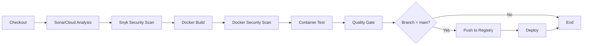

# DevOps CI/CD Pipeline Setup Guide

## 🚀 Complete DevOps Workflow with SonarCloud & Snyk

This guide will help you set up a complete CI/CD pipeline for the Todo App using Docker, Jenkins, SonarCloud, and Snyk.

---

## 📋 Table of Contents

1. [Prerequisites](#prerequisites)
2. [SonarCloud Setup](#sonarcloud-setup)
3. [Snyk Setup](#snyk-setup)
4. [Jenkins Setup](#jenkins-setup)
5. [Docker Configuration](#docker-configuration)
6. [Pipeline Workflow](#pipeline-workflow)
7. [Running the Pipeline](#running-the-pipeline)
8. [Troubleshooting](#troubleshooting)

---

## 🔧 Prerequisites

### Required Software
- ✅ **Rancher Desktop** (already installed) - provides Docker & Kubernetes
- ✅ **Git** - for version control
- ✅ **Docker & Docker Compose** - provided by Rancher Desktop

### Required Accounts (Free Tier Available)
- 🌐 **SonarCloud Account**: https://sonarcloud.io
- 🔒 **Snyk Account**: https://snyk.io
- 🐙 **GitHub/GitLab Account**: for repository hosting

---

## 🔍 SonarCloud Setup

### Step 1: Create SonarCloud Project

1. **Sign up/Login** to https://sonarcloud.io
2. Click **"+"** → **Analyze new project**
3. **Import your repository** from GitHub/GitLab/Bitbucket
4. **Create organization** (if first time)
5. **Note down**:
   - Organization Key: `your-org-key`
   - Project Key: `your-project-key`

### Step 2: Generate SonarCloud Token

1. Go to **Account** → **Security** → **Generate Token**
2. Name: `Jenkins-CI`
3. **Copy the token** (you won't see it again!)

### Step 3: Update Configuration

Edit `sonar-project.properties`:
```properties
sonar.organization=your-org-key
sonar.projectKey=your-project-key
```

---

## 🔒 Snyk Setup

### Step 1: Create Snyk Account

1. **Sign up** at https://snyk.io
2. **Connect your repository** (GitHub/GitLab/Bitbucket)
3. **Import your project**

### Step 2: Generate Snyk API Token

1. Go to **Account Settings** → **General**
2. Copy your **API Token** (under "Auth Token")

### Step 3: Update Configuration

Edit `.snyk` file:
```yaml
org: your-snyk-org-name
project-name: todo-app
remote-repo-url: https://github.com/your-username/todo-app
```

---

## 🤖 Jenkins Setup

### Option 1: Local Jenkins (using Docker Compose)

#### Start Jenkins:
```bash
docker-compose up -d jenkins
```

#### Access Jenkins:
1. Open: http://localhost:8081
2. Get initial password:
```bash
docker exec jenkins cat /var/jenkins_home/secrets/initialAdminPassword
```
3. **Install suggested plugins**
4. **Create admin user**

#### Install Required Plugins:
1. Go to **Manage Jenkins** → **Manage Plugins**
2. Install:
   - Docker Pipeline
   - SonarQube Scanner
   - Git plugin
   - Credentials Binding
   - Blue Ocean (optional, for better UI)

### Option 2: External Jenkins

If you already have Jenkins installed, ensure it has Docker access:
```bash
# Add Jenkins user to docker group
sudo usermod -aG docker jenkins
sudo systemctl restart jenkins
```

### Configure Credentials in Jenkins

1. **Go to**: Manage Jenkins → Manage Credentials → Global → Add Credentials

2. **Add SonarCloud Token**:
   - Kind: `Secret text`
   - Secret: `<your-sonarcloud-token>`
   - ID: `sonarcloud-token`

3. **Add Snyk Token**:
   - Kind: `Secret text`
   - Secret: `<your-snyk-token>`
   - ID: `snyk-token`

4. **Add Docker Registry Credentials**:
   - Kind: `Username with password`
   - Username: `<docker-hub-username>`
   - Password: `<docker-hub-password>`
   - ID: `docker-registry-credentials`

### Create Jenkins Pipeline Job

1. **New Item** → **Pipeline** → Name: `todo-app-pipeline`
2. **Pipeline** section:
   - Definition: `Pipeline script from SCM`
   - SCM: `Git`
   - Repository URL: `<your-repo-url>`
   - Branch: `*/main`
   - Script Path: `Jenkinsfile`
3. **Save**

---

## 🐳 Docker Configuration

### Build Docker Image Locally

```bash
# Build the image
docker build -t todo-app:latest .

# Run the container
docker run -d -p 8080:80 --name todo-app todo-app:latest

# Test the application
curl http://localhost:8080/health

# Stop and remove
docker stop todo-app && docker rm todo-app
```

### Using Docker Compose

#### Development Environment:
```bash
# Start all services (app, SonarQube, Jenkins)
docker-compose up -d

# View logs
docker-compose logs -f todo-app

# Stop all services
docker-compose down
```

#### Production Environment:
```bash
# Start production app only
docker-compose -f docker-compose.prod.yml up -d

# Stop
docker-compose -f docker-compose.prod.yml down
```

### Access Services:
- **Todo App**: http://localhost:8080
- **SonarQube** (local): http://localhost:9000
- **Jenkins**: http://localhost:8081

---

## 🔄 Pipeline Workflow

### Branch Strategy

```
main (production)
  ├── develop (integration)
  └── feature/* (feature branches)
```

### Pipeline Stages



#### Stage Details:

1. **Checkout**: Clone repository and get commit info
2. **Code Quality (SonarCloud)**: Analyze code quality, bugs, code smells
3. **Security Scan (Snyk)**: Check for vulnerabilities in code
4. **Docker Build**: Build Docker image
5. **Docker Security (Snyk)**: Scan Docker image for vulnerabilities
6. **Container Test**: Run health checks on container
7. **Quality Gate**: Verify SonarCloud quality gate passes
8. **Push to Registry**: (main branch only) Push image to Docker Hub
9. **Deploy**: (main branch only) Deploy to production

---

## 🚦 Running the Pipeline

### Method 1: Practical DevOps Workflow (Recommended)

#### 1. Create Feature Branch:
```bash
# Already created: feature/devops-pipeline
git status
```

#### 2. Commit and Push:
```bash
# Stage all files
git add .

# Commit changes
git commit -m "feat: Add DevOps CI/CD pipeline with SonarCloud and Snyk"

# Push to remote
git push -u origin feature/devops-pipeline
```

#### 3. Run Pipeline on Feature Branch:
- Jenkins will automatically trigger on push
- Or manually trigger from Jenkins dashboard

#### 4. Review Results:
- Check **SonarCloud**: https://sonarcloud.io/dashboard?id=your-project-key
- Check **Snyk**: https://app.snyk.io/projects
- Check **Jenkins**: http://localhost:8081/job/todo-app-pipeline/

#### 5. Merge to Main (after passing all checks):
```bash
# Switch to main
git checkout main

# Merge feature branch
git merge feature/devops-pipeline

# Push to main
git push origin main
```

#### 6. Production Deployment:
- Jenkins will automatically deploy to production on main branch
- Monitor deployment logs in Jenkins

### Method 2: Manual Testing

#### Test Locally:
```bash
# Build and test
docker build -t todo-app:test .
docker run -d -p 8080:80 todo-app:test

# Run SonarCloud scan locally
sonar-scanner

# Run Snyk scan locally
snyk test
snyk container test todo-app:test
```

---

## 📊 Monitoring & Reports

### SonarCloud Dashboard
- **Code Quality**: Bugs, vulnerabilities, code smells
- **Coverage**: Test coverage reports
- **Duplication**: Code duplication percentage
- **Security Hotspots**: Potential security issues

### Snyk Dashboard
- **Vulnerabilities**: Security vulnerabilities in dependencies
- **License Issues**: License compliance issues
- **Docker Security**: Container image vulnerabilities
- **Fix Recommendations**: Automatic fix suggestions

### Jenkins Dashboard
- **Build History**: All pipeline runs
- **Test Results**: Test execution results
- **Console Output**: Detailed logs
- **Blue Ocean**: Visual pipeline view

---

## 🔧 Troubleshooting

### Issue: Jenkins can't access Docker

**Solution**:
```bash
# Restart docker-compose with proper permissions
docker-compose down
docker-compose up -d

# Or mount Docker socket in Jenkins container
```

### Issue: SonarCloud token not found

**Solution**:
1. Verify credential ID matches: `sonarcloud-token`
2. Update Jenkinsfile if using different ID
3. Regenerate token if expired

### Issue: Snyk authentication fails

**Solution**:
```bash
# Test Snyk token locally
snyk auth <your-token>
snyk test
```

### Issue: Docker build fails

**Solution**:
```bash
# Check Docker is running
docker ps

# Check disk space
docker system df

# Clean up
docker system prune -a
```

### Issue: Quality Gate fails

**Solution**:
1. Review SonarCloud dashboard for issues
2. Fix code quality issues
3. Adjust quality gate settings in SonarCloud (if needed)

---

## 🎯 Best Practices

### Security
- ✅ Never commit tokens/credentials to repository
- ✅ Use Jenkins credentials management
- ✅ Regularly update dependencies
- ✅ Review Snyk vulnerability reports

### Code Quality
- ✅ Maintain >80% code coverage
- ✅ Fix critical/high severity issues
- ✅ Follow SonarQube quality profiles
- ✅ Regular code reviews

### Docker
- ✅ Use multi-stage builds
- ✅ Minimize image size
- ✅ Scan images before deployment
- ✅ Use specific version tags

### CI/CD
- ✅ Test in feature branches
- ✅ Automate everything
- ✅ Fast feedback loops
- ✅ Incremental improvements

---

## 📚 Additional Resources

- **SonarCloud Docs**: https://docs.sonarcloud.io
- **Snyk Docs**: https://docs.snyk.io
- **Jenkins Docs**: https://www.jenkins.io/doc
- **Docker Docs**: https://docs.docker.com

---

## 🎉 Next Steps

1. ✅ Complete SonarCloud and Snyk setup
2. ✅ Configure Jenkins credentials
3. ✅ Run first pipeline
4. ✅ Review and fix any issues
5. ✅ Merge to main and deploy!

---

## 📞 Support

For issues or questions:
- Check logs: `docker-compose logs service-name`
- Review Jenkins console output
- Check SonarCloud/Snyk dashboards

---

**Happy DevOps! 🚀**
